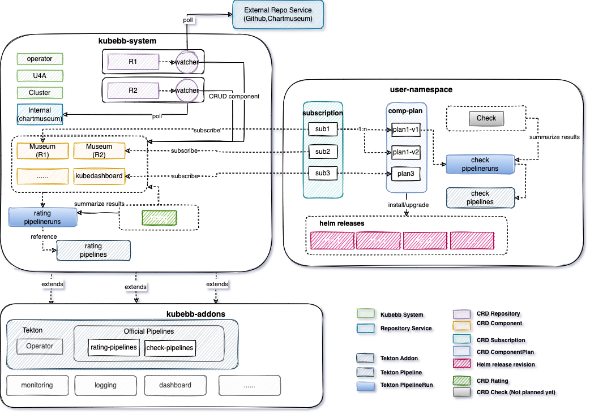

# Kubebb Core

[](https://codecov.io/gh/kubebb/core)

English | [简体中文](./README_zh.md)

Kubebb Core provides core implementations on Component Lifecycle Management.Our design and development follows [operator pattern](https://kubernetes.io/docs/concepts/extend-kubernetes/operator/) which extends kubernetes APIs.



## Why Kubebb-Core?

- declaratively component lifecycle management which is fully compatible with Helm ecosystem
- combines with low-code platform to offer a full-stack solution for kubernetes application development and deployment
- automatically upgrade component with subscription
- flexible and powerful manifest override mechanism


## Qucik Start

```shell
./hack/quick-install.sh
```

## Documentation

To learn more about KubeBB Core,[go to complete documentation](https://kubebb.github.io/website/).

To get started quickly with KubeBB Core, [go to quick start](https://kubebb.github.io/website/docs/category/快速开始).

## Contribute to Kubebb-Core

If you want to contribute to Kubb Core, refer to [contribute guidelines](https://kubebb.github.io/website/docs/contribute).

## Roadmap

You can get what we're doing and plan to do at [roadmap](https://kubebb.github.io/website/docs/core/roadmap).

## Acknowledgement

This project is standing on the shoulders of giants. We would like to thank the following projects.

- [controller-runtime](https://github.com/kubernetes-sigs/controller-runtime)
- [Helm](https://helm.sh/)
- [OLM](https://github.com/operator-framework/operator-lifecycle-manager)
- [Fluxcd](https://fluxcd.io/)
- [ArgoCD](https://argoproj.github.io/argo-cd/)

## Support

If you need support, start with the troubleshooting guide, or create GitHub [issues](https://github.com/kubebb/core/issues/new)
