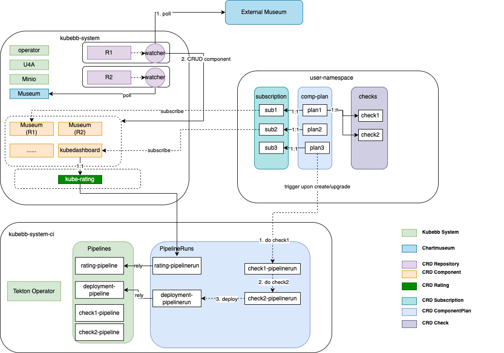

# Kubebb Core

[English](./README.md) | 简体中文

Kubebb Core 提供了组件生命周期管理的核心实现。我们的设计和开发遵循 [operator pattern](https://kubernetes.io/docs/concepts/extend-kubernetes/operator/)，实现Kubernetes API的扩展。

## 为什么选择 Kubebb-Core？

- 声明式的组件生命周期管理，完全兼容 Helm 生态系统
- 与低代码平台结合，为 Kubernetes 应用程序开发和部署提供全栈解决方案
- 使用订阅自动升级组件
- 灵活和强大的覆盖机制

## 文档

要了解有关 KubeBB Core 的更多信息，请[查看完整文档](https://kubebb.github.io/website/)。

要快速开始使用 KubeBB Core，请[查看快速入门](https://kubebb.github.io/website/docs/category/快速开始)。

## 贡献

如果您想为 Kubb Core 做出贡献，请参阅[贡献指南](https://kubebb.github.io/website/docs/contribute)。

## 路线图

您可以在[路线图](https://kubebb.github.io/website/docs/core/roadmap)中了解我们正在做什么和计划做什么。

## 致谢

该项目建立在巨人们的肩膀上。我们要感谢以下项目。

- [controller-runtime](https://github.com/kubernetes-sigs/controller-runtime)
- [Helm](https://helm.sh/)
- [OLM](https://github.com/operator-framework/operator-lifecycle-manager)
- [Fluxcd](https://fluxcd.io/)
- [ArgoCD](https://argoproj.github.io/argo-cd/)

## 支持

如果您需要支持，请从故障排除指南开始，或创建 GitHub [问题](https://github.com/kubebb/core/issues/new)。
